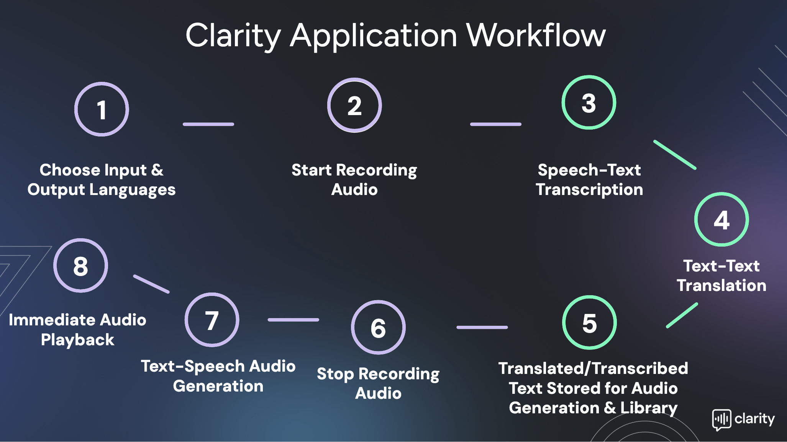
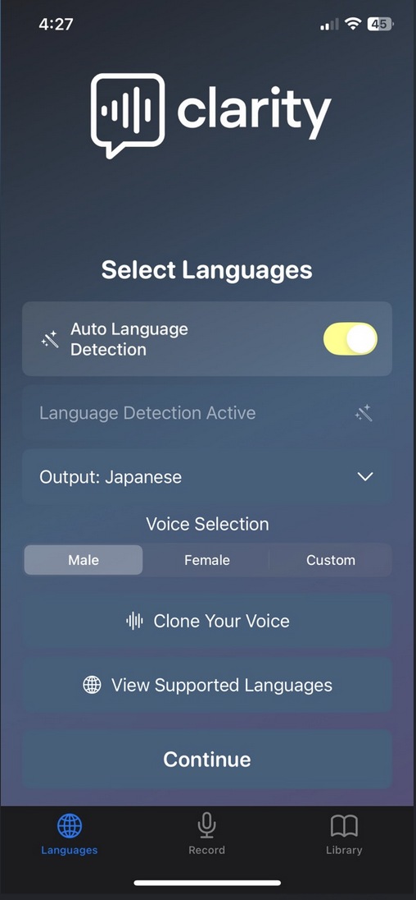
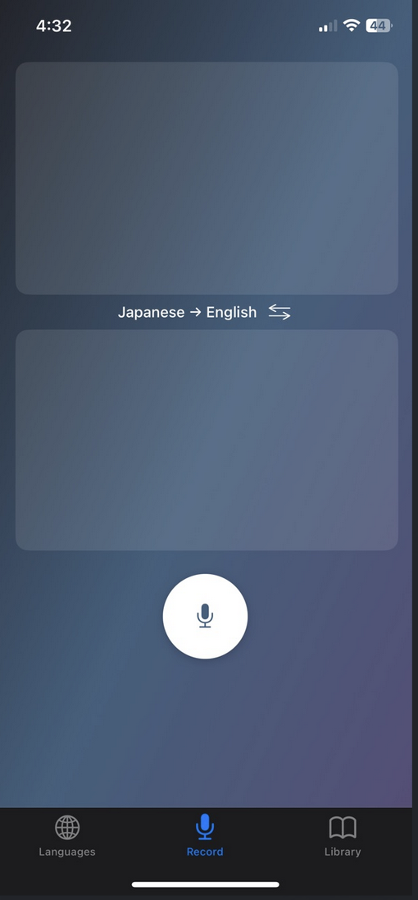
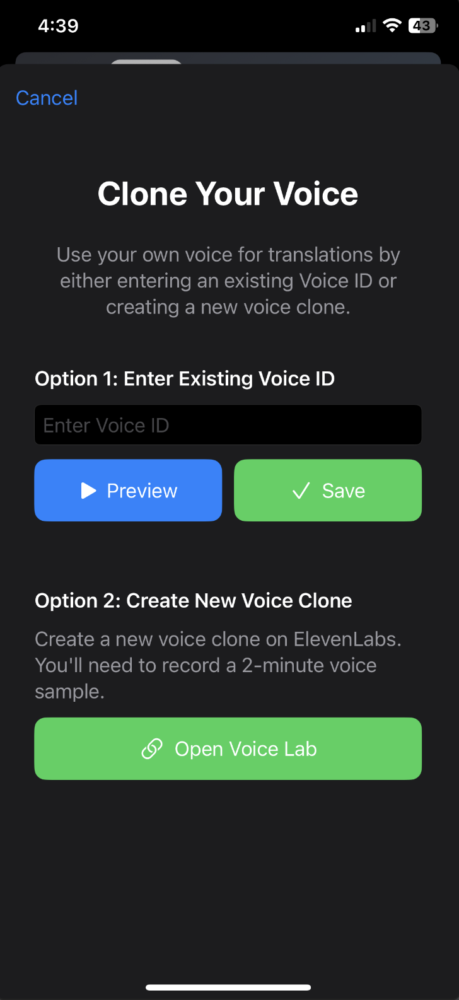
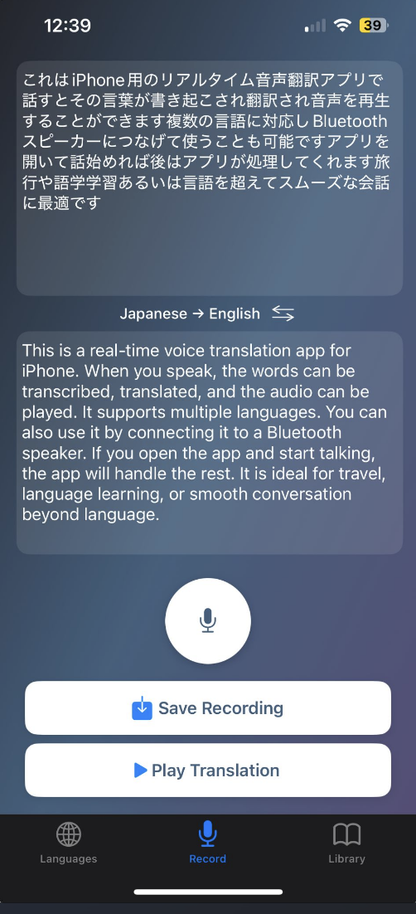
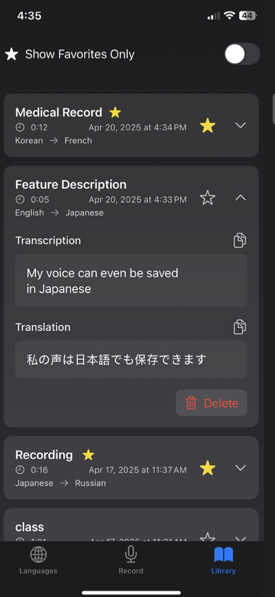

# Clarity

  

Clarity is a real-time communication enhancement platform that breaks down language barriers in the most human way possible. Using on-device AI, it instantly transcribes speech, translates in real-time, and speaks back in your own voice — making communication seamless for anyone facing language barriers or speech challenges.

Think of it as a personal interpreter that works anywhere, even offline. Whether you're in a hospital room with a CPAP mask or traveling through rural Japan without service, Clarity ensures you're understood. With features like automatic language detection, voice cloning, and conversation history, it's more than a translator — it's a bridge between people.

## 🔄 Application Workflow

  

Our streamlined workflow makes translation effortless:

1. **Choose Input & Output Languages**: Select languages or use auto-detection
2. **Start Recording Audio**: Begin speaking with a single tap
3. **Speech-Text Transcription**: Watch your words appear in real-time
4. **Text-Text Translation**: Instant translation to your target language
5. **Translated Text Storage**: Save translations for future use
6. **Stop Recording**: Finish your recording session
7. **Text-Speech Generation**: Convert text to natural speech
8. **Immediate Playback**: Listen to your translation instantly

## 📱 Real-World Usage

Here's Clarity in action:

  <table>
    <tr>
      <td align="center" width="33%">
        <strong>Language Selection</strong> 
         
        Auto-detection & voice options
      </td>
      <td align="center" width="33%">
        <strong>Recording Interface</strong> 
         
        Real-time transcription & translation
      </td>
      <td align="center" width="33%">
        <strong>Voice Selection</strong> 
         
        Customize voice output
      </td>
    </tr>
  </table>

### Additional Features

  <table>
    <tr>
      <td align="center" width="50%">
        <strong>Post-Recording View</strong> 
         
        Review and playback translations
      </td>
      <td align="center" width="50%">
        <strong>Library</strong> 
         
        Access saved conversations
      </td>
    </tr>
  </table>

### Key Interface Features

#### Language Selection
- Toggle for automatic language detection
- Clear language selection dropdown
- Voice gender options (Male/Female/Custom)
- Option to clone your own voice

#### Recording & Translation
- Real-time transcription window
- Live translation display
- Simple recording controls
- Clear audio input visualization

#### Voice Customization
- Multiple voice options per language
- Gender selection
- Custom voice cloning
- Voice preview capability

## ✨ Key Features

- **Real-Time Speech Recognition** - Instantly transcribe spoken words with high accuracy
- **Live Translation** - Seamless translation between multiple languages
- **Natural Voice Synthesis** - High-quality voice output in the target language
- **Offline Support** - Full functionality without internet connection
- **Language Auto-Detection** - Automatically identifies the spoken language
- **Library Storage** - Save and organize your translations for future reference
- **Gender Selection** - Choose between male and female voices for playback
- **Modern UI** - Clean, intuitive interface with smooth animations

## 🌍 Supported Languages

- English
- Spanish
- German
- Portuguese
- Japanese
- French
- Italian
- Russian
- Korean

## 📱 Requirements

- iOS 15.0 or later
- iPhone or iPad
- Microphone access for speech recognition
- Internet connection for optimal performance (optional)

## 🚀 Getting Started

1. **Download & Install**
   - Download Clarity from the App Store
   - Grant necessary permissions when prompted (microphone, speech recognition)

2. **First Use**
   - Select your preferred input and output languages
   - Choose your preferred voice gender
   - Start recording with a single tap

3. **Using Clarity**
   - Tap the microphone button to start recording
   - Speak clearly into your device
   - Watch as your speech is transcribed and translated in real-time
   - Tap the stop button when finished
   - Play back the translation in a natural-sounding voice
   - Save important translations to your library

## 💡 Pro Tips

- **Offline Mode**: Download language packs in Settings for offline use
- **Quick Switch**: Use the language swap button to quickly reverse translation direction
- **Voice Customization**: Switch between male and female voices for each language
- **Library Organization**: Save and categorize your most-used translations

## 🔒 Privacy

Clarity respects your privacy:
- All speech processing is done on-device when possible
- No recordings are stored without explicit user action
- Saved translations are stored locally on your device

## 🎯 Core Features Deep Dive

### 🎙️ Transcription & Translation
- **Real-Time Processing**: Instant speech-to-text conversion as you speak
- **Multiple Language Support**: Transcribe from any supported language
- **High Accuracy**: Advanced AI models ensure precise transcription
- **Punctuation & Formatting**: Maintains natural language structure
- **Continuous Mode**: Keep recording for longer conversations

### 🔍 Language Auto-Detection
- **Smart Recognition**: Automatically identifies the spoken language
- **Quick Switch**: Seamlessly change languages mid-conversation
- **Confidence Scoring**: Indicates detection accuracy
- **Multi-Dialect Support**: Recognizes regional variations
- **Override Option**: Manually select language if needed

### 🗣️ Voice Synthesis
- **Natural Sound**: High-quality, human-like voice output
- **Gender Selection**: Choose between male and female voices
- **Speed Control**: Adjust playback speed
- **Emotion Support**: Maintains tone and emphasis
- **Multiple Accents**: Regional accent options for major languages

### 👤 Custom Voice Cloning
- **Personal Voice Profile**: Create your own voice model
- **Quick Training**: 1-minute voice sample required
- **Multiple Profiles**: Save different voice models
- **Cross-Language**: Use your voice in any language
- **Privacy Protected**: Secure voice data storage

### 📚 Conversation History
- **Automatic Saving**: All translations stored locally
- **Search Function**: Find past conversations easily
- **Export Options**: Share conversations as text or audio
- **Categories**: Organize by topic or date
- **Cloud Backup**: Optional secure cloud storage

### 🌐 Offline Capabilities
- **Download Languages**: Store language packs locally
- **Offline Processing**: Full functionality without internet
- **Auto-Sync**: Updates when connection restored
- **Space Management**: Control storage usage
- **Performance Mode**: Optimized for offline use

## 💡 Advanced Tips

### Voice Cloning Best Practices
1. Record in a quiet environment
2. Speak naturally and clearly
3. Use varied sentences for better modeling
4. Test in different languages
5. Update your voice model periodically

### Optimizing Translation Quality
1. Speak at a natural pace
2. Use clear pronunciation
3. Avoid complex idioms
4. Check auto-detected language
5. Use context-specific vocabulary

### Managing Conversations
1. Label important conversations
2. Use folders for organization
3. Regular backup of favorites
4. Share translations securely
5. Clean up unused history

## 🔧 Technical Details

### Supported Audio Formats
- Input: WAV, MP3, AAC
- Output: WAV, MP3
- Sample Rate: 16kHz - 48kHz
- Bit Depth: 16-bit, 24-bit

### Performance Metrics
- Transcription Latency: <500ms
- Translation Speed: <1s
- Voice Synthesis: <2s
- Auto-Detection: <300ms

## 🏥 Real-World Impact: Healthcare Communication

### Breaking Language Barriers in Critical Care

  

#### The Challenge
A Spanish-speaking patient in Hartford Hospital's ICU needs to communicate vital information to English-speaking medical staff while wearing a CPAP mask. Traditional translation methods are slow and impersonal, potentially delaying critical care.

#### Clarity Solution
1. **Integrated Input**: Patient speaks into a microphone attached to their CPAP mask
2. **Real-Time Processing**:
   - Spanish speech is instantly transcribed
   - Text is accurately translated to English
   - Translation is voiced in patient's own cloned voice
3. **Clear Communication**: Medical staff hear the patient's concerns in clear English, maintaining the patient's own voice
4. **Documentation**: All interactions are saved for:
   - Medical records
   - Treatment history
   - Care analysis
   - Family updates

#### Benefits
- **Immediate Communication**: No waiting for translators
- **Personal Connection**: Patient's voice is preserved
- **Medical Accuracy**: Clear, precise translations of symptoms and concerns
- **Documentation**: Complete record of patient-staff communication
- **Reduced Anxiety**: Patients can express themselves naturally
- **Better Care**: Staff can respond quickly to patient needs

This real-world application demonstrates how Clarity breaks down language barriers in critical healthcare situations, potentially improving patient outcomes through better communication.

## 📄 License

Clarity is licensed under the MIT License. See the LICENSE file for details.
